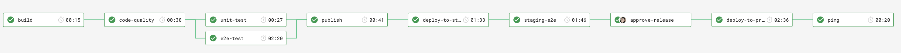

# Get to production!

Matthew Worthington

Note:

- Developer @ ThoughtWorks
- Twitter: worthington10

---

## What is a CI/CD pipeline?

- Initiates code builds
- Runs automated tests
- Deploys your code

Note:

- A CI/CD pipeline helps you automate steps in your software delivery process
- One artefact, promoted through a single pipeline, deployed to many environments

---

## Why do we use them?

- Reduce cost of deployment
- Remove manual errors
- Provide standardized development feedback loops
- Enable fast product iterations.

---

## Best practice

- Only build packages once
- Deploy the same way to every environment
- Smoke test your deployments
- Keep your environments similar

Note:

- We want to be sure the thing we’re deploying is the same thing we’ve tested throughout the deployment pipeline, so if a deployment fails we can eliminate the packages as the source of the failure.
- including development. This way, we test the deployment process many, many times before it gets to production, and again, we can eliminate it as the source of any problems.
- Have a script that validates all your application’s dependencies are available, at the location you have configured your application. Make sure your application is running and available as part of the deployment process.
- Keep your environments similar. Although they may differ in hardware configuration, they should have the same version of the operating system and middleware packages, and they should be configured in the same way. This has become much easier to achieve with modern virtualization and container technology.

---

## Triggers

- Code commit
- Scheduled/ CRON
- Manual

Note:

- Each change in code triggers an automated build-and-test sequence for the given project, providing feedback to the engineering team
- You may want to run tests constantly over a period or perform cleanup tasks
- In some situations a manual triggered pipeline or stage may be necessary, you may require sign-off from QA or have set release dates

---

## Let's get to production!

@snapend

@fa[rocket fa-5x fa-spin]

---

## What are we building?

---

## How are we building it?

---

## What should I have setup?